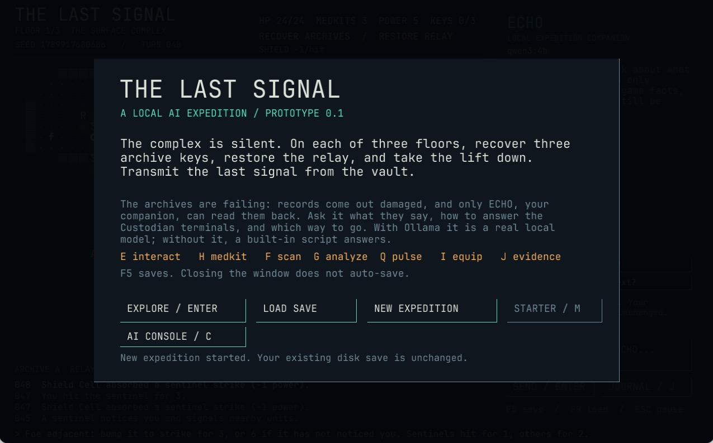
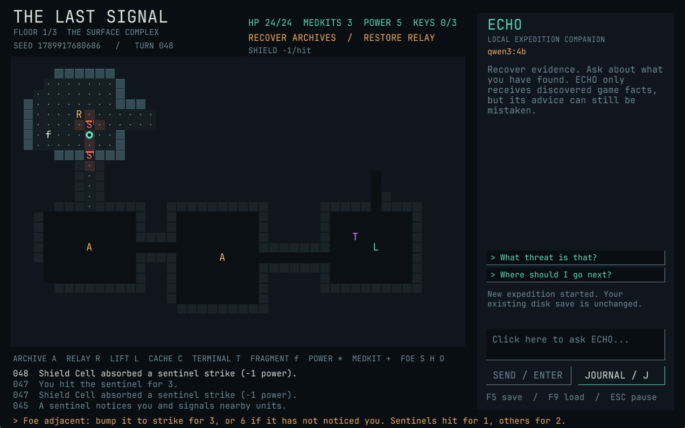

# The Last Signal





**[Try it in your browser](https://brucehoppe.github.io/the-last-signal/)**: a WebAssembly build of the real game. ECHO is a built-in script there and saving is off; the desktop build talks to a real local model through Ollama.

An original Rust expedition roguelike with an optional local-LLM companion.

**Version 0.1.0: a playable prototype and development handoff, not a finished commercial game.**

You descend a silent research complex: on each floor recover three archive keys, restore the relay and return to the lift, then choose what to transmit from the vault. The records you recover are damaged, and ECHO, your local AI companion, is the only one who can read them back. Combat, discovery, objectives, and rewards are enforced by Rust.

Start with **[START-HERE.md](START-HERE.md)**. No reference repositories need to be downloaded.

## Included

- **Three floors** (The Surface Complex, The Coolant Levels, The Signal Vault), each six procedural rooms joined into **loops**, so there is more than one way round a guard. The lift, relay, archive and cache rooms are shuffled per seed.
- **A reason to talk to ECHO.** Records come out of the failing archives *damaged*, with their longer words burned out. Only ECHO holds the full text: ask it what a record says and the journal shows it whole, along with ECHO's note on what it means for you. Each floor has a one-attempt **Custodian terminal** whose answer is written in that floor's records (right: full power and Custodian trust; wrong: drained power and an alerted floor). The ECHO panel offers **one-click questions**, and asking the way draws a **game-computed route** on the map. If Ollama is down, ECHO answers from its built-in script instead of failing.
- **Guards with awareness**: foes notice you later when idle at their posts, signal nearby units, path round corners, chase to where they last saw you, search, then walk home. Sentinels are leashed to their posts; Hunters track you briefly out of sight; the Overseer is slow and heavy. Break line of sight to lose them. Guards also **flank** when two are alert, sentinels **hold corridors** and **fall back** when hurt, hunters **sweep** rooms while searching, guards **remember where you ambushed** a unit, and the Overseer **calls reinforcements**. Each guard has its own seeded habits, so the rules are hard to memorise, yet every run still replays exactly.
- **Ambushes**: striking a foe that is not alert to you, or is stunned, does 6 instead of 3. Wait round a corner for a searching foe.
- **Four power modules** found in caches (one per floor, a slot opens per floor): Scanner Array, Shield Cell, Field Analyzer and the **Pulse Emitter** (stuns foes in sight). All draw on one power pool; **power cells** and **medkits** lie in room corners.
- **Standing that matters**: disabling foes costs Custodian trust; reading a faction's records and answering terminals earns it. Restore a relay in good standing and the Custodians' units **stand down** for your walk back; in bad standing the floor **locks down** and hunters deploy at the lift.
- **Optional data fragments**, one per floor, off the main path. The last one tells ECHO what it really is.
- **A choice of last signal** at the vault lift: a distress call, a Warden authorisation (needs Custodian trust) or ECHO's testimony (needs every fragment), each with its own rank and epilogue. Runs are **scored**, and a **daily signal** gives everyone the same seed for the day.
- Contextual onboarding hints, threat halos, awareness markers (! alert, ? searching, z stunned, - stood down), floating hit feedback and power costs on the HUD.
- A deterministic **action log**: every run replays from its seed, loadout and actions (`Game::replay_matches`).
- An **AI console** (title menu, or C) that lists your installed Ollama models, benchmarks them against this game's grounding rules, and saves your pick to `config.json`.
- An original graphical desktop interface drawn with code, with no external art assets.
- A real Ollama HTTP integration on a background thread, with JSON-schema responses, timeouts, bounded response size, and no remote fallback URL.
- A discovered-state context builder (the model never sees unrecovered records, unseen rooms, hidden foes or terminal answers) and saved conversation history.
- Versioned JSON saves written through a temporary file and atomic replacement; older saves migrate.
- Tests for connectivity, visibility, knowledge filtering, guard behaviour, terminals, endings, saves, difficulty band and the local HTTP contract.

## Run

Install Rust, then from this folder:

```sh
cargo run --locked --release
```

For a repeatable expedition:

```sh
cargo run --locked --release -- --seed 42
```

On Windows, use `run.cmd` after installing the prerequisites in START-HERE.

## Build distributions

On macOS, one script builds both packages into `dist/` (git-ignored):

```sh
scripts/dist.sh            # both; or: scripts/dist.sh macos | windows
```

- `the-last-signal-<version>-macos-universal.zip`: `The Last Signal.app` for Apple silicon and Intel, ad-hoc signed. It is not notarized, so a copy downloaded from the internet needs right-click > Open the first time. The bundled app keeps `config.json` beside its save, in `~/.local/share/the-last-signal/`.
- `the-last-signal-<version>-windows-x64.zip`: `the-last-signal.exe`, cross-compiled with MinGW-w64 (`brew install mingw-w64`; the script adds the Rust targets it needs). It links only to DLLs that ship with Windows 10 and later.

On a Windows machine, run `dist.cmd` instead; it builds the MSVC executable and zips it. Neither package bundles a model: install Ollama separately for the real ECHO.

## Browser demo

The same Rust game compiles to WebAssembly (`cargo build --release --target wasm32-unknown-unknown`, then serve `web/` with the `.wasm` beside `index.html`). On wasm, `ureq`, `tempfile` and disk saves are excluded, and ECHO answers from a rule-based script that reads only the discovered-state snapshot. GitHub Actions builds and publishes it on every push to `main`. `web/gl.js` is miniquad's JS loader, the same version as the crate in `Cargo.lock` (MIT/Apache-2.0).

## Local AI

Install and open Ollama, then download a local model:

```sh
ollama pull qwen3:4b
```

Open the **AI console** from the title menu to see every installed model, test them (each is asked to avoid leaking a record you have not recovered and to use one you have, and is timed) and pick the best. Or click the chat box, type a question, and press Enter. If the model cannot be reached, ECHO answers from its built-in script and says so. The model is not included in this ZIP. You can play without Ollama. To change the model or port, copy `config.example.json` to `config.json`; configuration is reloaded for every request. Model speed and quality depend on hardware. This is a starting candidate, not a benchmarked best model.

## Controls

| Key | Action |
|---|---|
| Arrows / WASD | Move; bump a foe to attack (3, or 6 as an ambush); walk over supplies and fragments |
| E | Interact from the same or an adjacent tile: archive, cache, terminal, relay, lift |
| H | Use a medkit: up to 10 HP, maximum 24 |
| F | Scanner Array: spend 1 power to extend sight until the next turn |
| I | Equipment: fit or unfit found modules (costs a turn) |
| G | Field Analyzer: spend 2 power to pinpoint the nearest unrecovered archive through walls |
| Q | Pulse Emitter: spend 2 power to stun foes in sight within 3 tiles for 2 turns |
| M / C (title menu) | Starting-module choice / AI console |
| Space | Wait one turn |
| J | Open recovered evidence |
| F5 / F9 | Save / load |
| Escape | Unfocus chat, close journal, or open pause menu |
| Enter | Start/resume from menu, or submit focused chat |
| Mouse wheel over chat | Scroll conversation |
| Click a suggested question | Ask ECHO in one click |

While typing in chat, movement keys enter text. Click outside the box or press Escape to return to movement. The game does not auto-save on closing. A save made during generation contains the player's question but not a reply that has not arrived yet; save again after the reply if you want it persisted.

## Documents

- [Laptop setup](START-HERE.md)
- [Design and roadmap](docs/DESIGN.md)
- [Architecture and local AI](docs/ARCHITECTURE.md)
- [Reference lessons and links](docs/REFERENCES.md)
- [AI coding handoff](docs/HANDOFF.md)
- [Validation and limitations](docs/VALIDATION.md)

The source is original to this package. Reference games supplied design and engineering lessons; their source code and assets are not bundled or copied. Original project code is MIT-licensed; dependencies retain their own licenses.

## Performance

The game core runs in microseconds per turn (`cargo test --release --test perf -- --ignored --nocapture`); rendering costs about 0.04 ms of CPU per frame on the map, with the frame rate limited by vsync. The release profile uses LTO and stripping. Fonts: JetBrains Mono (SIL OFL 1.1, `assets/fonts/OFL.txt`).
